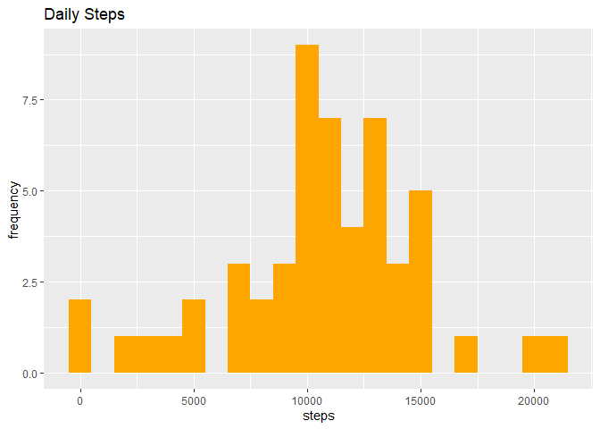
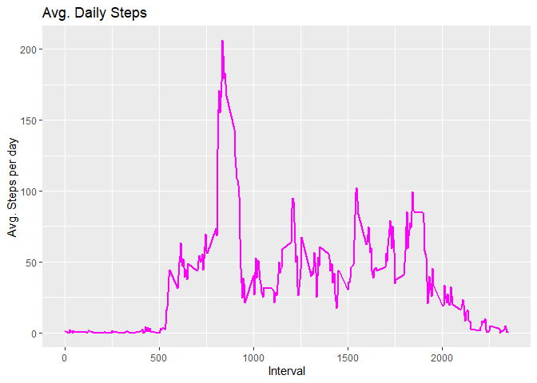

## Loading and preprocessing the data


```r
library("data.table")
library(ggplot2)

activityDT <- data.table::fread(input = "activity.csv")
```

## What is mean total number of steps taken per day?


```r
total_steps <- activityDT[, c(lapply(.SD, sum, na.rm = FALSE)), .SDcols = c("steps"), by = .(date)]

pl <- ggplot(total_steps, aes(x=steps)) + geom_histogram(fill="orange", binwidth = 1000) +
        labs(title="Daily Steps", y = "frequency")
print(pl)
```

```
## Warning: Removed 8 rows containing non-finite values (stat_bin).
```

<!-- -->

#### Mean and median of the total number of steps taken per day

```r
total_steps[, .(Mean_Steps = mean(steps, na.rm = TRUE), Median_Steps = median(steps, na.rm = TRUE))]
```

```
##    Mean_Steps Median_Steps
## 1:   10766.19        10765
```


## What is the average daily activity pattern?


```r
IntervalDT <- activityDT[, c(lapply(.SD, mean, na.rm = TRUE)), .SDcols = c("steps"), by = .(interval)] 

pl<-ggplot(IntervalDT, aes(x = interval , y = steps)) + geom_line(color="magenta", size=1) + 
        labs(title = "Avg. Daily Steps", x = "Interval", y = "Avg. Steps per day")
print(pl)
```

<!-- -->

#### Which 5-minute interval, on average across all the days in the dataset, contains the maximum number of steps?


```r
IntervalDT[steps == max(steps), .(max_interval = interval)]
```

```
##    max_interval
## 1:          835
```

## Imputing missing values

#### Number of missing values in the dataset


```r
activityDT[is.na(steps), .N ]
```

```
## [1] 2304
```

#### Filling in missing values with median


```r
activityDT[is.na(steps), "steps"] <- activityDT[, c(lapply(.SD, median, na.rm = TRUE)), .SDcols = c("steps")]
```


#### Create a new dataset that is equal to the original dataset but with the missing data filled in


```r
data.table::fwrite(x = activityDT, file = "activity_filled.csv", quote = FALSE)
```

#### Make a histogram of the total number of steps taken each day and Calculate and report the mean and median total number of steps taken per day.


```r
Total_Steps <- activityDT[, c(lapply(.SD, sum)), .SDcols = c("steps"), by = .(date)] 
Total_Steps[, .(Mean_Steps = mean(steps), Median_Steps = median(steps))]
```

```
##    Mean_Steps Median_Steps
## 1:    9354.23        10395
```

```r
pl <- ggplot(Total_Steps, aes(x = steps)) + geom_histogram(fill = "blue", binwidth = 1000) + 
        labs(title = "Daily Steps", x = "Steps", y = "Frequency")
print(pl)
```

<!-- -->


## Are there differences in activity patterns between weekdays and weekends?

#### Create a new factor variable in the dataset with two levels – “weekday” and “weekend” indicating whether a given date is a weekday or weekend day.


```r
activityDT <- data.table::fread(input = "activity.csv")
activityDT[, date := as.POSIXct(date, format = "%Y-%m-%d")]
activityDT[, `Day of Week`:= weekdays(x = date)]
activityDT[grepl(pattern = "Monday|Tuesday|Wednesday|Thursday|Friday", x = `Day of Week`), "weekday or weekend"] <- "weekday"
activityDT[grepl(pattern = "Saturday|Sunday", x = `Day of Week`), "weekday or weekend"] <- "weekend"
activityDT[, `weekday or weekend` := as.factor(`weekday or weekend`)]
head(activityDT, 10)
```

```
##     steps       date interval Day of Week weekday or weekend
##  1:    NA 2012-10-01        0      Monday            weekday
##  2:    NA 2012-10-01        5      Monday            weekday
##  3:    NA 2012-10-01       10      Monday            weekday
##  4:    NA 2012-10-01       15      Monday            weekday
##  5:    NA 2012-10-01       20      Monday            weekday
##  6:    NA 2012-10-01       25      Monday            weekday
##  7:    NA 2012-10-01       30      Monday            weekday
##  8:    NA 2012-10-01       35      Monday            weekday
##  9:    NA 2012-10-01       40      Monday            weekday
## 10:    NA 2012-10-01       45      Monday            weekday
```


#### Make a panel plot containing a time series plot (i.e. \color{red}{\verb|type = "l"|}type="l") of the 5-minute interval (x-axis) and the average number of steps taken, averaged across all weekday days or weekend days (y-axis)


```r
activityDT[is.na(steps), "steps"] <- activityDT[, c(lapply(.SD, median, na.rm = TRUE)), .SDcols = c("steps")]
IntervalDT <- activityDT[, c(lapply(.SD, mean, na.rm = TRUE)), .SDcols = c("steps"), by = .(interval, `weekday or weekend`)] 

pl<-ggplot(IntervalDT , aes(x = interval , y = steps, color=`weekday or weekend`)) + 
        geom_line() + labs(title = "Avg. Daily Steps by Weektype", x = "Interval", y = "No. of Steps") + 
        facet_wrap(~`weekday or weekend` , ncol = 1, nrow=2)
print(pl)
```

<!-- -->
